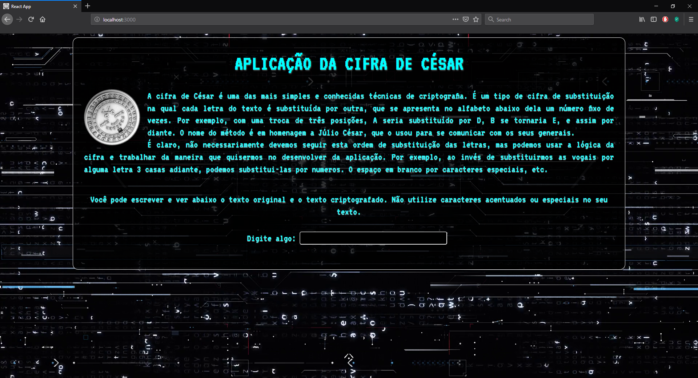
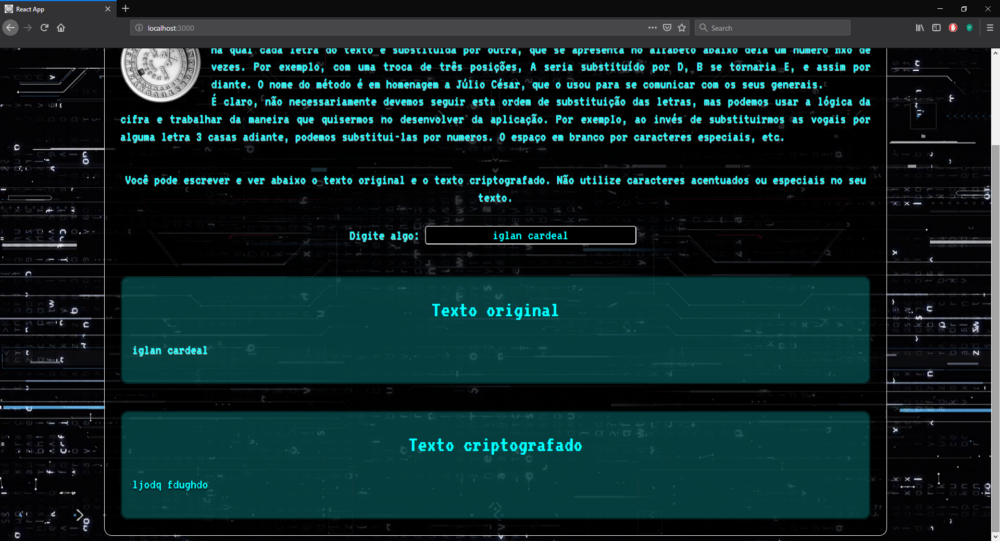

<h1>Cifra de César</h1>
Pequena aplicação criada usando React. Consiste em um criptografador de texto, onde o usuário pode digitar e ele irá visualizar o texto original e o texto criptografado com a cifra de César.
 
Abaixo imagens da aplicação

 
Para ver a aplicação, basta iniciar o terminal no diretório do projeto, digitar 'npm i' para instalar as dependências e depois 'npm start' e uma aba será aberta no navegador com a aplicação executando.
